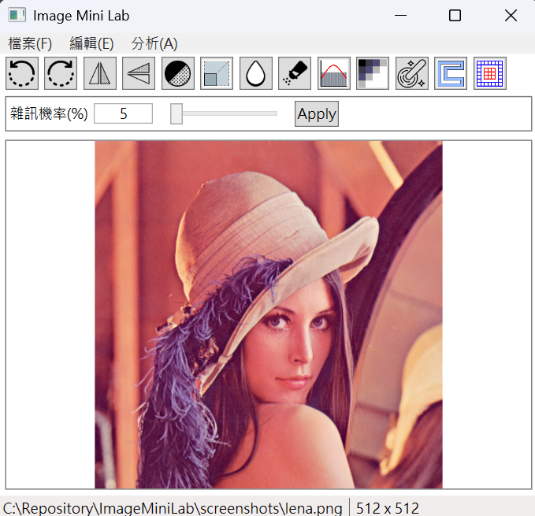

# 🖼️ Image Mini Lab

**Image Mini Lab** is a WPF desktop application built with the **MVVM pattern**.  
It implements common image processing algorithms **from scratch** and provides a **user-friendly GUI** to experiment with them.  

---

## ✨ Features

- **Image Processing Algorithms**
  - Grayscale conversion (average / weighted)
  - Rotation & flipping
  - Salt & Pepper noise
  - Gaussian noise
  - Mosaic effect
  - Scaling with bilinear interpolation
  - Convolution with custom kernels
  - Gaussian smoothing
  - Edge detection
  - Histogram equalization

- **User Interface**
  - Toolbar with one-click actions
  - Dynamic secondary toolbar (ContentControl + DataTemplate)  
    → Displays tool-specific parameter controls
  - Keyboard shortcuts (Ctrl+O, Ctrl+S, Ctrl+Z, Ctrl+Shift+Z)

- **Undo / Redo Support**
  - History tracking using `Stack<RawImage>`

---

## 🖥️ Screenshots

### User Interface

### Histroram Equalization

### Custom convolution mask

---

## 🛠️ Tech Stack

- **UI Framework**: WPF
- **Architecture**: MVVM (via [CommunityToolkit.Mvvm](https://learn.microsoft.com/dotnet/communitytoolkit/mvvm/))
- **Image Core**: Custom `RawImage` class  
  - Stores pixels as `byte[] BGRA`
  - Converts easily to `BitmapSource` for display
- **Plotting**: [ScottPlot](https://scottplot.net/) for histogram visualization
- **Cross-platform image IO**: [SkiaSharp](https://github.com/mono/SkiaSharp)

---

## 📂 Project Structure

